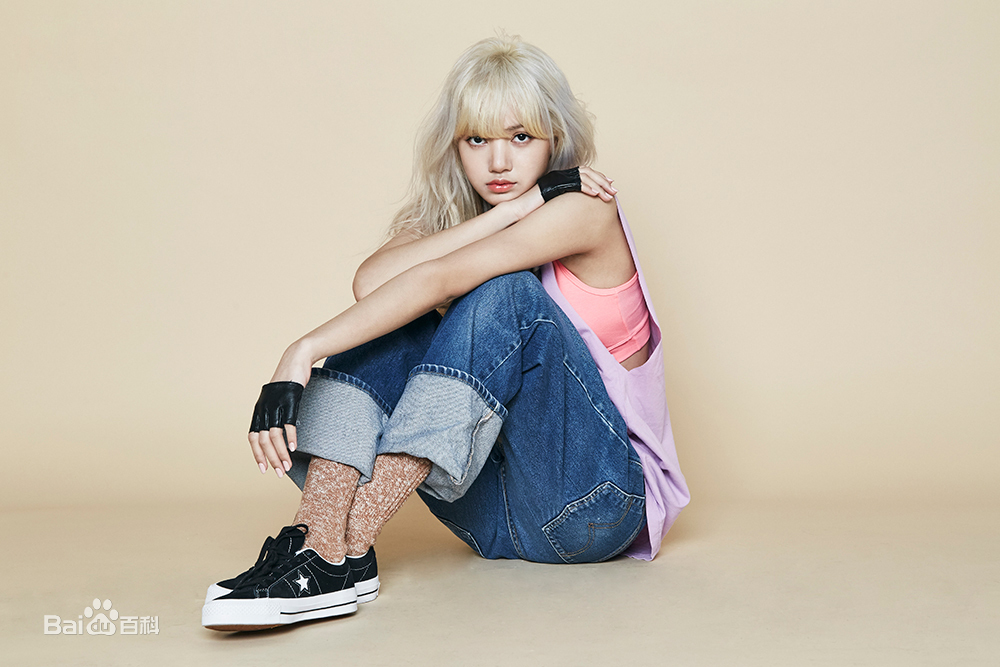

<body>

<h1>Black pink</h1>

    <a href="Kim Ji-soo.html">Kim Ji-soo</a> 
 <a href="Kim Ji-ni.html">Kim Ji-ni 
 <a href="Park Was.html">Park Was 
 <a href="LISA.html">LISA 

<h1>Kim Ji-soo</h1>

Kim Ji-soo was born on January 3, 1995 in Gogagakawa City, Gyeonggi, South Korea, a Korean female singer, actor, host, member of the women's singing group BLACKPINK.

On August 8, 2016, he officially debuted as a member of BLACKPINK and released his first single album, SQUARE ONE, with the group, and on November 1, he released his second solo album, SQUARE TWO. On February 5, 2017, he began working on the music program "Popular Ballad" MC; on June 22, he released the single "As If It's Your Last" with the group; and on August 30, he released the Japanese-language music album "Blackpink" with the group. On June 15, 2018, the group released its first mini-album, SQUARE UP. In January 2019, the world tour of BLACKPINK 2019 WORLD TOUR with KIA (YOUR IN AREA) begins with the combination; On May 28, 2020, the combined release of the collaboration single "Sour Candy" with Lady Gaga, the combined release of the collaboration single "Ice Cream" with Selena Gomez on August 28, and the release of the official album "THE ALBUM" on October 2, 2020.

On August 18, 2020, Kim decided to star in JTBC's new drama Snowdrops, which will be her first challenge to lead roles. 

 

 

<h1>Kim Ji-ni</h1>

Kim Ji-ni was born on January 16, 1996 in Qingtandong, Gangnam District, Seoul, South Korea, a South Korean female singer and member of the women's singing group BLACKPINK.

On August 8, 2016, he officially debuted as a member of BLACKPINK and released his first single album, SQUARE ONE, with the group, and on November 1, he released his second solo album, SQUARE TWO. On August 30, 2017, the Japanese-language debut album "Blackpink" was released with the group. On June 15, 2018, the mini-album "SQUARE UP" will be released with the combo; the first Japanese Arena Tour "BLACKPINK Arena Tour 2018" will be held with the group from July 24; and the solo single "SOLO" will be released on November 12. 

On April 5, 2019, the japanese version of the mini-album KILL THIS LOVE will be released with the group, and on October 16, the Japanese version of the mini-album "Kill This Love" will be released with the group. On May 28, 2020, the combined release of the collaboration single "Sour Candy" with Lady Gaga, the June 26 release of the combined single "How You Like That", the 28 August release of the collaboration single "Ice Cream" with Selena Gomez, and the release of the first official album "THE ALBUM" on October 2.

 

<h1>Park Was</h1>

Park Was born on February 11, 1997 in Auckland, New Zealand, a South Korean female singer and member of the women's singing group BLACKPINK.

On August 8, 2016, he became a member of BLACKPINK and released his first single album, SQUARE ONE, with the group, and on November 1, he released his second solo album, SQUARE TWO. On July 20, 2017, the group officially announced its debut in Japan with its first overseas Showcase at japan's Takedao Pavilion, and on August 30, the group officially released its Japanese-language debut album Blackpink.

 On June 15, 2018, the mini-album SQUARE UP will be released with the group, and the first Japan Arena Tour 2018 will be held with the group from July 24. On April 5, 2019, a mini-album, KILL THIS LOVE, was released with the release of the album. June 26, 2020, with the release of the single "How You Like That", October 2, 2020 with the release of the combined album "THE ALBUM."

 
         

<h1>LISA</h1>

LISA, born on March 27, 1997 in Wulinan Province, Thailand, developed in Korea, Thai pop singer, dancer, member of the women's singing group BLACKPINK.

In 2016, he became a member of BLACKPINK and released his first solo album, SQUARE ONE, with the release of the group. On November 1st, the group released its second solo album, SQUARE TWO. In December, the group won two awards, Best of Next and Best MV, at the Mnet Asian Music Awards. On July 20, 2017, the group held its first overseas Showcase at japan's Takedao Pavilion, officially announcing its debut in Japan. On August 30, the Japanese-language music album "Blackpink" was released with the group. From July 24, 2018, the first Japanese tour "BLACKPINK Arena Tour 2018" will be held with the group. In January 2019, the "BLACKPINK 2019 WORLD TOUR with KIA (IN YOUR AREA)" World Tour began in Bangkok. 

On March 12, 2020, the variety show "Youth Has You Season 2", which is attended as a dance instructor, opens at Aichi.
    
 
    

Copyright TINA.com.cn

 </body>

